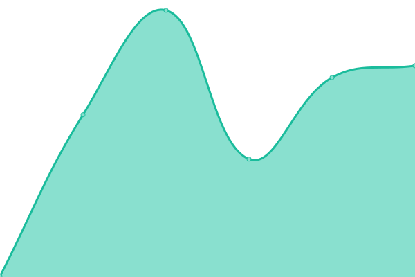

# [📈 Live Status](https://uptime.onedns.ch): <!--live status--> **🟧 Partial outage**

This repository contains the open-source uptime monitor and status page for [Pablo Wynistorf](https://www.pablo.one), powered by [Upptime](https://github.com/upptime/upptime).

With [Upptime](https://upptime.js.org), you can get your own unlimited and free uptime monitor and status page, powered entirely by a GitHub repository. We use [Issues](https://github.com/Pablo-Wynistorf/uptime/issues) as incident reports, [Actions](https://github.com/Pablo-Wynistorf/uptime/actions) as uptime monitors, and [Pages](https://uptime.onedns.ch) for the status page.

<!--start: status pages-->
<!-- This summary is generated by Upptime (https://github.com/upptime/upptime) -->
<!-- Do not edit this manually, your changes will be overwritten -->
<!-- prettier-ignore -->
| URL | Status | History | Response Time | Uptime |
| --- | ------ | ------- | ------------- | ------ |
|  [Oneidp](https://oneidp.ch) | 🟩 Up | [oneidp.yml](https://github.com/Pablo-Wynistorf/uptime/commits/HEAD/history/oneidp.yml) | 

 546ms
     
 | 

<a href="https://uptime.onedns.ch/history/oneidp">66.08%</a>
    

|  [Webpagent](https://webpagent.ch) | 🟥 Down | [webpagent.yml](https://github.com/Pablo-Wynistorf/uptime/commits/HEAD/history/webpagent.yml) | 

 665ms
     
 | 

<a href="https://uptime.onedns.ch/history/webpagent">65.76%</a>
    

|  [Onedns](https://onedns.ch) | 🟥 Down | [onedns.yml](https://github.com/Pablo-Wynistorf/uptime/commits/HEAD/history/onedns.yml) | 

 849ms
     
 | 

<a href="https://uptime.onedns.ch/history/onedns">64.72%</a>
    

|  [Free CDN](https://cdn.onedns.ch) | 🟩 Up | [free-cdn.yml](https://github.com/Pablo-Wynistorf/uptime/commits/HEAD/history/free-cdn.yml) | 

 800ms
     
 | 

<a href="https://uptime.onedns.ch/history/free-cdn">64.72%</a>
    

<!--end: status pages-->

[**Visit our status website →**](https://uptime.onedns.ch)

## 📄 License

- Powered by: [Upptime](https://github.com/upptime/upptime)
- Code: [MIT](./LICENSE) © [Anand Chowdhary](https://anandchowdhary.com), supported by [Pabio](https://pabio.com)
- Data in the `./history` directory: [Open Database License](https://opendatacommons.org/licenses/odbl/1-0/)
